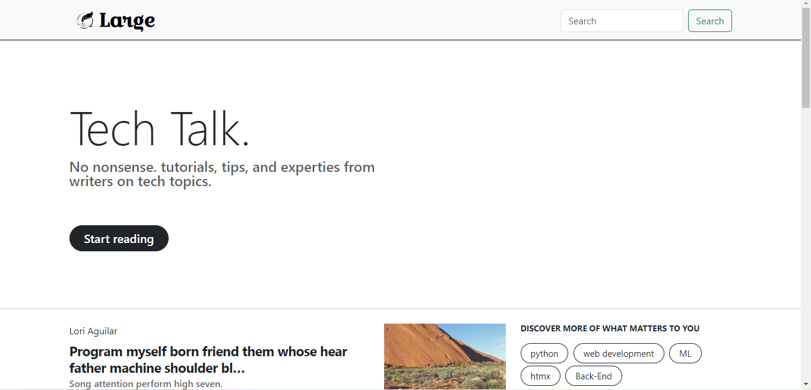

# BlogWebsite

This project is building a blog website with django and htmx, I named it Large ( bigger than medium 😜).

At this point the website is very simple, two pages and basic styling. The Goal is to iteratively add features until it's almost feature complete with CMS, MySQL database, user authentication, and comment section.

### what this project currently has

- two pages one listing available blogs and one for reading the blogs
- tags associated with blogs
- basic markdown support
- filtering with tags
- infinite scroll

How it looks for now

